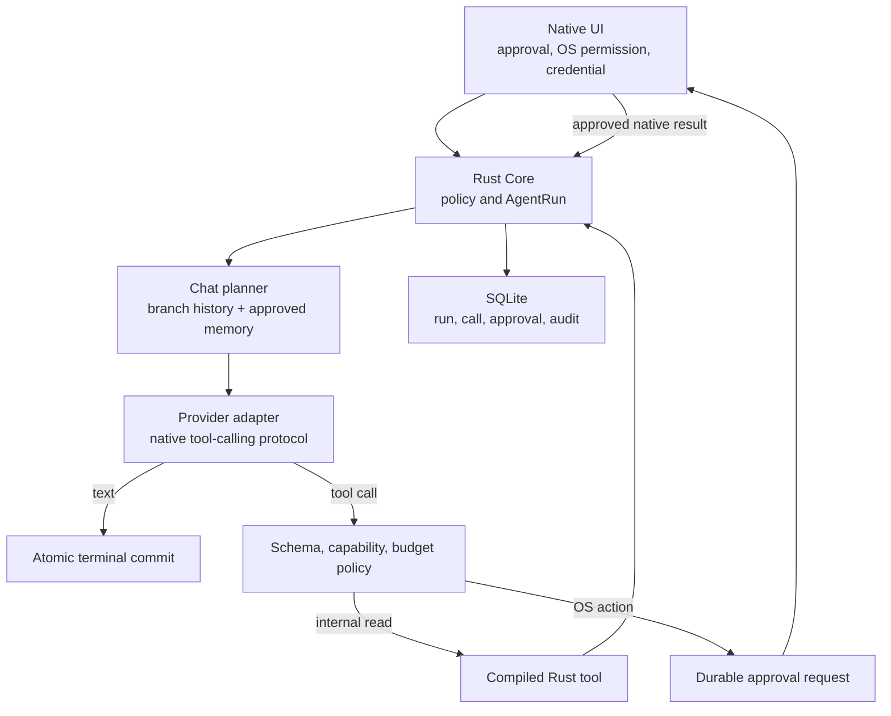

# Agent 기능 조사와 LorePia 도입안

## 결정 요약

Hermes와 OpenClaw는 LorePia에 넣을 library가 아니라, 별도의 Python/Node
runtime, gateway, plugin 생태계, shell과 browser 제어까지 포함한 범용 agent
운영체제에 가깝다.

LorePia에는 두 프로젝트의 코드를 dependency나 subprocess로 넣지 않는다.
공식 문서에서 확인한 기능의 목적과 실패 사례만 참고하고, 다음 기능을
Rust core와 native UI 경계 안에서 no-copy 방식으로 독자 구현한다. 이는
법률상 형식화된 clean-room 인증을 뜻하지 않는다.

1. 사용자가 보고 수정·삭제할 수 있는 branch-aware 캐릭터 기억
2. provider-neutral tool call과 build에 포함된 first-party typed tool
3. default-deny 승인, 실행 예산, 취소, 복구, redacted audit
4. 실행 코드가 없는 선언적 procedure와 proposal→diff→approve 흐름
5. 고정 역할의 제한된 read-only delegation
6. 상시 gateway가 아닌 OS lifecycle 기반 로컬 reminder/automation

다음 항목은 현재 제품 경계에서 제외한다.

- Hermes/OpenClaw runtime 내장 또는 vendor
- localhost/web gateway와 외부 messaging bot
- MCP server, third-party plugin, marketplace와 자동 설치
- shell, arbitrary code, unrestricted filesystem
- 로그인된 browser profile, computer use, 원격 node 제어
- character package가 포함하거나 활성화하는 실행 코드
- 무승인 memory/skill 수정과 외부 side effect

이 설계는 코드 수정안이 아니라 후속 구현을 위한 연구 결과다. 구현 전에는
[2026-07-28 코드 리뷰](../reviews/2026-07-28-repository-review.md)의 P1을
먼저 해결해야 하며, 모든 외부 도입은
[제3자 라이선스 정책](../development/third-party-license-policy.md)을
통과해야 한다.

## 조사 기준과 대상 식별

조사일은 2026-07-28이다. 빠르게 변하는 프로젝트이므로 이름만 기록하지
않고 tag와 commit을 함께 고정했다.

### Hermes Agent

- 공식 저장소:
  [`NousResearch/hermes-agent`](https://github.com/NousResearch/hermes-agent)
- 비교 기준:
  [`v2026.7.20`, 제품 버전 0.19.0](https://github.com/NousResearch/hermes-agent/releases/tag/v2026.7.20),
  commit
  [`3ef6bbd201263d354fd83ec55b3c306ded2eb72a`](https://github.com/NousResearch/hermes-agent/commit/3ef6bbd201263d354fd83ec55b3c306ded2eb72a)
- 2026-07-28 02:09 UTC 조사 종료 시 main snapshot:
  [`fa7b0fcf5d6e3576a59514ef1e281cd1e0872b8b`](https://github.com/NousResearch/hermes-agent/commit/fa7b0fcf5d6e3576a59514ef1e281cd1e0872b8b)
- 공식 문서:
  [hermes-agent.nousresearch.com](https://hermes-agent.nousresearch.com/)

여기서 Hermes는 Nous Research의 agent application을 뜻하며, 이름이 비슷한
모델이나 제3자 mirror를 조사 대상으로 삼지 않는다.

### OpenClaw

- 공식 저장소:
  [`openclaw/openclaw`](https://github.com/openclaw/openclaw)
- 비교 기준:
  [`v2026.7.1`](https://github.com/openclaw/openclaw/releases/tag/v2026.7.1),
  commit
  [`2d2ddc43d0dcf71f31283d780f9fe9ff4cc04fe4`](https://github.com/openclaw/openclaw/commit/2d2ddc43d0dcf71f31283d780f9fe9ff4cc04fe4)
- 공식 사이트와 문서:
  [openclaw.ai](https://openclaw.ai/),
  [docs.openclaw.ai](https://docs.openclaw.ai/)

[`pjasicek/OpenClaw`](https://github.com/pjasicek/OpenClaw/tree/5ee5740ca98377c76b13b50c84f610b0066a4717)는 1997년 게임
Captain Claw 재구현이며
[GPL-3.0](https://github.com/pjasicek/OpenClaw/blob/5ee5740ca98377c76b13b50c84f610b0066a4717/LICENSE.txt)이다.
AI agent OpenClaw와 전혀 다른 프로젝트이므로 검색, 소스 참고, dependency
선정에서 명시적으로 제외한다. `Clawdbot`과 `Moltbot`은 공식 agent의 이전
이름이지만, 구현 근거는 현재 공식 owner와 고정 tag에서만 취한다.

## LorePia의 현재 기준선

LorePia에는 이미 다음 기반이 있다.

- Android, iOS, macOS, Windows native UI와 하나의 Rust core
- bounded JSON/CHARX inspect, review, commit과 SQLite/CAS persistence
- 캐릭터별 여러 room, `chat`/`story` mode, parent-linked branch
- OpenAI-compatible streaming, generation identity, cancellation과 recovery
- provider profile과 요청 수명 credential 전달
- high-level UniFFI/C ABI와 versioned event

근거는 [architecture overview](overview.md),
[provider and chat](provider-and-chat.md),
[import pipeline](import-pipeline.md)에 있다.

이 문서에서 native UI의 `room`은 domain/API의 `conversation`과 같은 대상을
뜻한다. 이후 저장·권한·기억 범위에는 `conversation`을 쓰고, 실제 화면을
설명할 때만 `room`을 쓴다.

반면 현재 제품에는 다음 의미의 agent 기능이 없다.

| 영역 | 현재 상태 | 새로 필요한 것 |
|---|---|---|
| Agent loop | 한 번의 model request와 terminal response | 여러 model invocation과 tool result를 묶는 durable `AgentRun` |
| Tools | text/reasoning delta만 있음 | schema, call, approval, dispatcher, result protocol |
| Memory | 선택 branch의 최근 message suffix | 명시적 record, scope, provenance, 검색·승인·삭제 |
| Permissions | import review와 OS credential | capability, risk class, one-shot decision, expiry |
| Audit | generation status와 event | tool/approval/egress의 durable redacted ledger |
| Background | process 수명의 generation | lease, idempotency, retry, OS wakeup |
| Skills | 없음 | 실행 코드 없는 bounded procedure만 검토 |
| Sandbox | hostile archive 검사 | tool worker, network/file policy와 resource budget |

대화 저장을 agent memory라고 부르거나 import sandbox를 execution sandbox라고
부르면 안 된다. 현재 pending generation은 restart 때 다시 실행되지 않고
terminal 상태로 정리되며, in-memory event bus는 audit log가 아니다.

## 외부 기능 조사

### 기능 비교

| 기능 | Hermes | OpenClaw | LorePia 판단 |
|---|---|---|---|
| Persistent memory | bounded `MEMORY.md`/`USER.md`, SQLite FTS5 session search, 선택적 write approval | 기본 `memory-core` plugin의 Markdown memory, SQLite keyword/vector/hybrid index, 선택적 dreaming | **도입**. SQLite FTS와 사용자 승인부터 시작하고 cloud embedding은 기본 제외 |
| Tools/toolsets | 중앙 registry, availability check, toolset, 여러 terminal backend | profile/allow-deny/sandbox를 거친 exec, file, web, browser, message, node tool | **축소 도입**. build에 포함된 typed read-only tool만 |
| Skills | `SKILL.md`, progressive disclosure, agent write/update, Hub/Git/local source | scope와 allowlist가 있는 `SKILL.md`, proposal-first Workshop apply와 ClawHub/install. apply 승인이 기본이지만 설정으로 자동화할 수 있음 | **데이터 전용으로만 도입**. 실행·설치·remote Hub 없음 |
| Approval | 위험 command 탐지, allow/deny와 container 옵션 | exec approval, tool policy, sandbox, elevated mode | **더 엄격하게 도입**. 모델 판정이 아닌 Rust default-deny, 초기에는 항상 허용 없음 |
| Delegation | isolated child, summary return, 동시성과 깊이 제한 | nested subagent, context mode, spawn/depth/concurrency/cascade stop | **후순위**. 고정 역할, depth 1, read-only |
| Automation | cron/interval, fresh session, delivery와 execution ledger | built-in cron, heartbeat, detached task ledger, hook/webhook, plugin 기반 Task Flow | **제한 도입**. local reminder와 app resume 처리부터 |
| Gateway/channels | CLI와 messaging gateway, 여러 채널 | long-lived Gateway와 채널/plugin/node | **제외**. server와 외부 채널은 현재 제품 경계 밖 |
| Browser/device control | cloud/local browser와 외부 computer-use driver | managed/signed-in browser, paired-node device command, 별도 Codex Computer Use MCP | **초기 제외**. 필요하면 read-only search/extract를 별도 단계로 |
| Provider routing | 여러 API mode, local/custom provider, auxiliary model | 여러 model provider와 per-agent routing | **원칙만 도입**. capability/egress를 명시하고 credential을 endpoint와 원자적으로 결합 |

공식 근거:

- Hermes:
  [memory](https://github.com/NousResearch/hermes-agent/blob/v2026.7.20/website/docs/user-guide/features/memory.md),
  [skills](https://github.com/NousResearch/hermes-agent/blob/v2026.7.20/website/docs/user-guide/features/skills.md),
  [tools](https://github.com/NousResearch/hermes-agent/blob/v2026.7.20/website/docs/user-guide/features/tools.md),
  [cron](https://github.com/NousResearch/hermes-agent/blob/v2026.7.20/website/docs/user-guide/features/cron.md),
  [delegation](https://github.com/NousResearch/hermes-agent/blob/v2026.7.20/website/docs/user-guide/features/delegation.md),
  [browser](https://github.com/NousResearch/hermes-agent/blob/v2026.7.20/website/docs/user-guide/features/browser.md),
  [computer use](https://github.com/NousResearch/hermes-agent/blob/v2026.7.20/website/docs/user-guide/features/computer-use.md),
  [security](https://github.com/NousResearch/hermes-agent/blob/v2026.7.20/website/docs/user-guide/security.md)
- OpenClaw:
  [architecture](https://github.com/openclaw/openclaw/blob/v2026.7.1/docs/concepts/architecture.md),
  [memory](https://github.com/openclaw/openclaw/blob/v2026.7.1/docs/concepts/memory.md),
  [tools](https://github.com/openclaw/openclaw/blob/v2026.7.1/docs/tools/index.md),
  [skills](https://github.com/openclaw/openclaw/blob/v2026.7.1/docs/tools/skills.md),
  [subagents](https://github.com/openclaw/openclaw/blob/v2026.7.1/docs/tools/subagents.md),
  [exec approvals](https://github.com/openclaw/openclaw/blob/v2026.7.1/docs/tools/exec-approvals.md),
  [sandboxing](https://github.com/openclaw/openclaw/blob/v2026.7.1/docs/gateway/sandboxing.md),
  [cron](https://github.com/openclaw/openclaw/blob/v2026.7.1/docs/automation/cron-jobs.md),
  [Task Flow](https://github.com/openclaw/openclaw/blob/v2026.7.1/docs/automation/taskflow.md),
  [plugin runtime](https://github.com/openclaw/openclaw/blob/v2026.7.1/docs/tools/plugin.md),
  [paired nodes](https://github.com/openclaw/openclaw/blob/v2026.7.1/docs/nodes/index.md),
  [Codex Computer Use](https://github.com/openclaw/openclaw/blob/v2026.7.1/docs/plugins/codex-computer-use.md),
  [security policy](https://github.com/openclaw/openclaw/blob/v2026.7.1/SECURITY.md)

### 배울 점

- memory와 full transcript search를 분리하면 항상 prompt에 넣는 token을 작게
  유지할 수 있다.
- tool schema는 모델에게 capability를 설명하는 동시에 runtime 검증 계약이어야
  한다.
- long-running work에는 `running` 하나가 아니라 approval 대기, native result
  대기, retry, terminal state가 필요하다.
- completed result를 delivery 전에 잃지 않도록 durable ledger와 idempotency가
  필요하다.
- child agent는 fresh context, 명시적 budget, 제한된 capability를 가져야 한다.
- exact schedule과 context-aware periodic check는 제품 의미가 다르다.
- provider, model, endpoint, credential source와 데이터 egress를 한 화면에서
  설명해야 한다.

### 그대로 가져오면 안 되는 점

- OpenClaw의 workspace는 그 자체로 sandbox가 아니며 plugin은 process 안에서
  실행되는 trusted code다.
- Hermes/OpenClaw 모두 shell, remote tool, browser, messaging을 켜면 공격
  표면이 character chat보다 훨씬 커진다.
- regex command approval, 모델 기반 approval, 한 번의 broad arm은 권한
  경계로 충분하지 않다.
- 외부 web, message, tool result, imported character text는 모두 prompt
  injection 입력이 될 수 있다.
- memory에 저장된 문장을 security policy로 사용하면 안 된다.
- agent가 memory나 active procedure를 자동으로 바꾸는 기본값은 캐릭터
  일관성과 사용자의 통제를 훼손할 수 있다.
- long-lived gateway와 multi-channel routing은 LorePia의 local native app
  경계와 맞지 않는다.

## 권장 제품 정의

목표는 “OpenClaw/Hermes 복제품”이 아니다. LorePia의 agent 기능은 다음처럼
정의한다.

> 캐릭터별 로컬 기억을 사용하고, 사용자가 명시적으로 허용한 작은
> capability를 통해 읽기 전용 조사와 제안을 수행하며, 모든 실행을 중단,
> 검토, 복구할 수 있는 native character agent.

기존 `Chat`과 `Story`는 계속 tool-free가 기본이다. Agent는 세 번째
`ConversationMode`가 아니라 `Chat`/`Story`와 직교하는 conversation/request
`AgentPolicy` opt-in으로 둔다. character card나 imported content는 이를
자동 활성화하거나 grant를 확대하지 못한다.

## 목표 아키텍처



소유권은 기존 dependency rule을 유지한다.

- `domain`: provider-neutral `AgentRun`, `ToolDefinition`, `ToolCall`,
  `ToolResult`, `CapabilityGrant`, `MemoryItem`
- `providers`: provider wire format과 capability detection만
- `chat`: prompt ordering, tool-result meaning, memory budget와 branch lineage
- `storage`: run/step/call/grant/memory/audit의 SQLite transaction
- `core`: registry, policy, approval, budgets, cancellation, orchestration
- bindings: 고수준 DTO와 command 변환만
- native: approval UI, picker, OS permission/action, credential, lifecycle

provider가 tool을 직접 실행하거나 binding에 `execute_raw_tool(json)` 같은
API를 두지 않는다.

## 핵심 상태 모델

기존 `generations`는 provider 호출 한 번을 표현한다. 하나의 agent turn에는
여러 invocation과 tool call이 있을 수 있으므로 별도의 부모 상태가 필요하다.

### `AgentRun`

- conversation, branch, expected head, pending assistant
- mode와 `AgentPolicy`
- provider adapter/protocol, canonical endpoint, profile/revision, model,
  timeout과 non-secret setting, credential reference/revision snapshot
- tool-schema와 policy version
- `queued`
- `model_running`
- `awaiting_approval`
- `tool_running`
- `native_dispatching`
- `awaiting_native_result`
- `unknown_outcome`
- `awaiting_resume`
- `completed`
- `failed`
- `cancelled`
- step, tool-call, token, byte, wall-time, cost budget
- idempotency key와 revision

### 하위 record

- `ModelInvocation`: ordinal, model/profile snapshot, status, usage
- `ToolCall`: tool/version, canonical bounded arguments, risk, status
- `ApprovalDecision`: displayed summary hash, decision, actor, timestamp, expiry
- `AgentAuditEvent`: redacted action, data destination, result status
- `RunMemorySnapshot`: run에 실제 사용한 memory ID/version/hash
- `RunProcedureSnapshot`: run에 실제 사용한 procedure ID/version/hash

credential reference는 native store가 소유하는 opaque identity이며 secret은
SQLite에 저장하지 않는다.

run 시작 transaction은 `(conversation, branch, expected_head, user message,
pending assistant, run)`을 원자적으로 만든다. 같은 branch에 nonterminal
run이 있으면 edit, regenerate, remove와 새 agent turn을 막는다. invariant는
`branch_id`당 nonterminal `AgentRun` 최대 하나이며 expected head는 시작
CAS에만 사용한다. run의
provider/profile snapshot이 바뀌거나 삭제됐거나 credential revision이
철회됐으면 현재 default profile로 다시 묶지 않고 fail-closed한다.

유효 전이는 다음과 같다.

| 현재 상태 | 허용되는 다음 상태 |
|---|---|
| `queued` | `model_running`, `cancelled`, `failed` |
| `model_running` | `awaiting_approval`, `tool_running`, `native_dispatching`, terminal |
| `awaiting_approval` | `tool_running`, `native_dispatching`, `awaiting_resume`, `cancelled`, `failed` |
| `tool_running` | `awaiting_resume`, terminal |
| `native_dispatching` | `awaiting_native_result`, `unknown_outcome`, proven terminal |
| `awaiting_native_result` | `awaiting_resume`, `unknown_outcome`, proven terminal |
| `unknown_outcome` | OS 조회나 사용자 확인 뒤 `awaiting_resume` 또는 proven terminal |
| `awaiting_resume` | credential을 받은 `resume_agent_run` 뒤 `model_running`, `cancelled`, `failed` |

`completed`, `failed`, `cancelled`는 terminal이다. SQLite commit 전에 native
side effect를 시작하지 않는다. side effect가 시작됐는지 모르는 상태에서
crash가 나면 `unknown_outcome`으로 전환하고 동일 intent를 자동 재실행하지
않는다. 사용자가 결과를 확인한 뒤 새 revision으로 계속하거나 끝낸다.
native dispatch 뒤 terminal 전이는 native가 미실행 또는 결과를 확정적으로
증명한 경우에만 허용한다. 앱 종료나 단순 cancel처럼 결과가 불명확하면
반드시 `unknown_outcome`으로 간다.

완료된 답변을 regenerate하면 새 branch와 새 run을 만들고 과거 approval을
재사용하지 않는다. 이미 발생한 notification 같은 side effect는 rewind로
삭제하거나 숨기지 않고 audit에 `superseded` 관계를 남긴다. 새 run이 같은
side effect를 요청하면 새 승인과 새 idempotency key가 필요하다.

## 기능 1 — 승인형 캐릭터 기억

가장 먼저 추가할 agent 기반이다. Stage 1에서는 사용자가 기억을 관리하는
기능부터 만들고, 실제 prompt 포함과 model proposal은 AgentRun이 생긴 Stage
3에서 켠다.

### 사용자 기능

- 메시지 action의 “기억하기”
- model이 제안한 memory 후보의 승인/거절
- 캐릭터별 memory 목록, 검색, 수정, pin, 삭제
- 각 memory의 source conversation/branch/message와 생성 방식 표시
- 이번 request에 어떤 memory가 포함되는지 미리 보기
- memory export와 전체 삭제
- character별 memory 사용 on/off

### scope

- 기본: run 시작 transaction에 고정한 branch/expected-head lineage의
  ancestor source만 사용
- conversation 승격: 사용자가 명시적으로 선택한 경우 해당 conversation의 sibling
  branch에도 사용
- character 승격: 사용자가 명시적으로 선택한 경우 다른 conversation에도 사용
- global user profile: 첫 버전에서 제외

한 branch에서 추출한 사실을 자동으로 character-wide memory에 넣으면 기존
branch isolation을 우회하므로 금지한다.

memory 후보 선택 결과는 run 생성 때 ID/version/hash로 snapshot하고 resume
때 다시 검색하지 않는다. 이후 active branch가 바뀌어도 run의 lineage는
바뀌지 않는다. source message가 logical removal되거나 branch가 rewind되면
memory는 자동 삭제하지 않고 `source_unavailable` tombstone으로 비활성화해
사용자에게 provenance 손실을 보여 준다.

### 저장과 검색

- 첫 버전은 SQLite FTS lexical search
- bounded top-K와 총 byte/scalar/token 예산
- content hash, version, source lineage, sensitivity, expiry
- API key, password, OTP, credential-shaped tool result는 후보에서 강제 제외
- vector embedding과 cloud memory provider는 기본 제외

자동 memory review는 후일 opt-in이다. model이 제안을 만들 수는 있지만 active
memory를 직접 쓰지 않는다.

## 기능 2 — provider-neutral tool call

Agent 기능은 provider가 공식적으로 반환하는 structured tool call만 실행한다.
assistant text 안의 JSON, XML, Markdown, ReAct 문장을 명령으로 파싱하는
fallback은 두지 않는다. tool calling을 지원하지 않는 provider는 기존
Chat/Story만 제공한다.

필요한 의미는 다음과 같다.

- `ProviderCapabilities.tool_calling`
- `ToolDefinition`
- `ToolCallStarted`
- `ToolArgumentsDelta`
- `ToolCallCompleted`
- `ToolResult`
- 여러 invocation의 누적 usage

기존 event enum에 field만 추가하지 않고 Core API, event schema, UniFFI,
C ABI를 하나의 versioned change로 올린다.

## 기능 3 — first-party typed tool

초기 registry는 build에 포함된 project-owned tool만 가진다.

첫 후보:

- `time.now`: locale/timezone이 명시된 현재 시각
- `dice.roll`: story에서 쓸 수 있는 bounded deterministic random contract
- `memory.search`: 현재 scope의 승인된 memory 검색
- `lore.search`: imported character/world data 중 core가 이미 승인한 text 검색
- `conversation.search`: 기본은 run의 고정 lineage만 검색

`conversation.search`의 sibling branch, 다른 conversation 또는 character-wide
검색은 별도 capability다. 사용자가 범위를 직접 지정하고, 결과가 다음
provider invocation으로 나가기 전에 per-run egress 승인을 받아야 한다.

후속 후보:

- `web.search`: query와 외부 destination을 표시하는 read-only 검색
- `web.extract`: public HTTP(S), bounded text, redirect/SSRF 정책이 있는 추출
- `file.read_grant`: native picker가 발급한 opaque grant의 bounded read
- `reminder.schedule`: 승인 화면에 제안을 표시한 뒤 실행하는 `os_write`

`file.read_grant`의 Android content URI와 Apple security-scoped resource
수명은 native가 소유한다. Rust에는 raw path나 OS token을 넘기지 않는다.
native가 grant를 검증해 bounded stream/bytes와 content hash만
`submit_native_tool_result`로 전달하고, 중단·만료·picker 취소도 명시적
terminal result로 보낸다.

초기 금지:

- shell/terminal/code execution
- absolute path나 arbitrary filesystem
- file write/delete
- message/post/purchase/account action
- browser click/type와 logged-in session
- credential read
- dynamically discovered MCP/plugin tool

tool ID 충돌은 후등록 우선이 아니라 startup failure다. schema와 handler
version, argument/result 크기, timeout, concurrency를 고정한다.

## 기능 4 — 권한과 승인

effective capability는 다음 교집합이다.

```text
compiled product allowlist
∩ current mode allowlist
∩ conversation grant
∩ platform OS permission
∩ per-call policy decision
```

권장 위험 등급:

| 등급 | 예시 | 첫 버전 동작 |
|---|---|---|
| `internal_read` | memory/lore 검색 | activity 표시 후 자동 허용 가능 |
| `local_proposal` | memory/procedure/reminder 후보 | 활성 데이터는 바꾸지 않음 |
| `local_write` | memory 수정·삭제 | 매 호출 승인 |
| `scoped_os_read` | picker grant 파일 읽기 | grant와 호출을 모두 검증 |
| `os_write` | reminder 생성 | 앱 승인과 OS permission |
| `external_read` | web search/extract | destination과 전송 query 표시 |
| `external_side_effect` | 전송·게시·구매 | 첫 버전 미지원 |
| `system_control` | shell/browser/computer | 미지원 |

초기에는 “항상 허용”을 제공하지 않는다. timeout, 앱 종료, stale revision,
unknown tool, malformed args는 모두 deny로 끝난다. 승인 화면에는 실행할
행동, 정확한 대상, 기기 밖으로 나가는 데이터, 사용할 credential, 비용과
취소 가능성을 표시한다.

`internal_read`도 policy engine을 통과하지만 사용자 prompt를 매번 요구할
필요는 없다. 사용자 승인은 local/OS write, 넓은 transcript scope, 외부
egress처럼 표에서 요구한 위험 등급에만 적용한다.

provider credential은 approval 대기 동안 Rust가 잡고 있지 않는다. 다음
model invocation 때 native credential store가 다시 공급한다.

## 기능 5 — 선언적 procedure

Hermes/OpenClaw의 skill에서 유용한 부분은 반복 절차의 재사용이지 임의 실행
코드가 아니다. LorePia의 첫 형태는 `ProcedureSpec` 같은 data-only record다.

- project-owned 또는 사용자가 직접 작성
- bounded name, description, instruction
- 허용된 first-party tool ID만 참조
- 필요한 capability를 선언하지만 확대할 수 없음
- shell hook, binary, script, native library, dependency install 없음
- 생성/수정은 proposal→diff→approve
- 사용자 직접 작성은 `user_authored`, content hash와 timestamp 기록
- 외부 표현물을 import하려면 source URL/hash, SPDX, notice와 provenance 기록
- character package는 활성화할 수 없고 요청 후보만 제시 가능
- remote marketplace와 자동 update 없음

Prompt, skill, template도 저작권 대상일 수 있으므로 외부 프로젝트의 파일을
복사하지 않는다.

## 기능 6 — 제한적 delegation

일반-purpose subagent fleet보다 캐릭터 제품에 맞는 고정 역할부터 시작한다.

- `continuity_reviewer`
- `world_lore_researcher`
- `scene_planner`

제약:

- fresh context
- depth 1
- 부모당 동시 2개
- read-only internal tool만
- memory/procedure write 금지
- native action과 외부 side effect 금지
- bounded structured summary만 부모에게 반환
- 총 token/time/step budget에 포함
- 부모 cancel 시 cascade stop

private conversation trajectory를 자동 export하거나 학습 데이터로 쓰지 않는다.

## 기능 7 — 로컬 automation

항상 켜진 gateway 없이 플랫폼 lifecycle을 사용한다.

- SQLite가 durable job, run history, lease, idempotency를 소유
- native가 실제 OS notification 예약·수정·취소를 소유
- background wakeup은 due-work를 발견하는 hint이며 정시 model 실행 보장이 아님
- 첫 기능은 one-shot local notification/reminder
- 앱이 resume될 때 due work를 확인
- 모바일 앱이 종료된 동안 model 작업 완료를 보장하지 않음
- side effect step은 crash 후 자동 반복하지 않음
- recurring job이 새 recurring job을 만드는 recursion 금지
- provider, model, 최대 비용, 실행 횟수와 expiry를 snapshot

SQLite와 OS side effect 사이에는 원자 transaction이 없으므로 다음
reconciliation protocol이 필요하다.

1. Rust가 idempotency key, native invocation ID와 결정적 OS request
   identifier가 있는 durable intent를 먼저 commit한다.
2. native가 OS object를 만들고 object ID와 정규화된 결과를 반환한다.
3. Rust가 result와 terminal state를 commit한다.
4. 2와 3 사이에 crash하면 OS 조회가 가능한 플랫폼은 미리 저장한 request
   identifier나 object ID로 reconcile하고, 확인할 수 없으면
   `unknown_outcome`으로 둔다.
5. 결과 불명 intent를 자동으로 다시 만들지 않는다.

Stage 4는 이 one-shot handoff만 다룬다. Stage 7의 반복 규칙은 Rust가 다음
occurrence를 계산하되, 각 occurrence를 새 intent로 OS에 넘긴다. 플랫폼별
구현을 선택하기 전에 다음 acceptance matrix를 실제 기기에서 채운다.

| 조건 | 필수로 기록할 동작 |
|---|---|
| due time과 timezone/DST 변경 | 정확·지연 가능·누락 중 실제 보장 |
| 앱 종료와 기기 재부팅 | OS object 유지 여부와 app-resume reconciliation |
| 알림/background 권한 철회 | 사용자 표시, fail-closed와 재승인 |
| job 수정·취소 | 기존 OS object 조회와 중복 제거 |
| model work | 앱 비활성 상태에서 best-effort인지 명시 |

desktop background generation도 명시적 opt-in과 비용 상한 이후에만 검토한다.

## 고수준 Core API 초안

이 이름은 구현 계약이 아니라 ownership과 vertical slice를 설명하는 초안이다.

```text
start_agent_turn(request, credential) -> AgentRun
get_agent_run(run_id) -> AgentRun
get_agent_run_snapshot(run_id, after_step_cursor) -> AgentRunSnapshot
resume_agent_run(run_id, expected_revision, credential) -> AgentRun
cancel_agent_run(run_id)

list_pending_tool_approvals(conversation_id)
resolve_tool_approval(call_id, expected_revision, decision)
submit_native_tool_result(call_id, expected_revision, result)

list_memory_items(scope)
list_memory_proposals(scope)
approve_memory_proposal(id, expected_revision)
reject_memory_proposal(id, expected_revision)
update_memory_item(id, expected_revision, content)
delete_memory_item(id, expected_revision)

list_procedures(scope)
inspect_procedure_draft(source)
approve_procedure_draft(id, expected_revision)
enable_procedure(id, conversation_id, expected_revision)
```

모든 mutating command에는 expected revision 또는 idempotency key가 필요하다.
binding은 SQLite row나 raw provider payload를 노출하지 않는다.
`AgentRunSnapshot`은 run, invocation, call, approval, result와 redacted audit를
canonical 순서로 반환해 event 유실 뒤 UI를 완전히 재구성할 수 있어야 한다.
`resolve_tool_approval`은 decision만 저장한다. 다음 model invocation이
필요하면 native가 `resume_agent_run`으로 현재 revision과 credential을 다시
제공해야 하며, Core가 default profile의 secret을 임의로 다시 읽지 않는다.

## 단계별 구현 순서

### Stage 0 — 기존 안정화

완료 조건:

- exclusive `data_root` lock
- terminal generation compensation
- v2→v3 migration tie/rollback 처리
- C ABI와 event schema version 정리
- CI rename source/destination 모두 감지
- Windows profile/credential 전환의 원자적 사용자 계약
- Android generation 재진입 복구
- Android import commit/discard 상호 배제
- provider terminal/SSE validation
- dropped-event native reconciliation test

Stage 1 진입 조건은 위 Stage 0 완료 조건 전체를 충족하는 것이다. 여기에는
최소한 코드 리뷰의 P1 `CR-01`부터 `CR-08`까지의 해소와 관련 강제 테스트의
필수 CI 통과가 포함된다.

### Stage 1 — manual memory governance

- domain/storage/core/binding/native UI를 한 번에 연결
- 사용자가 직접 만드는 branch-scoped memory
- source/provenance와 list/edit/delete/export/full-delete
- pin, FTS search와 character별 on/off
- 아직 model prompt에는 넣지 않으며 proposal도 생성하지 않음
- restart, branch fork, delete, sensitive-data tests

### Stage 2 — AgentRun과 tool protocol

- durable parent run과 여러 model invocation
- Chat/Story와 직교하는 `AgentPolicy` storage/API/native UI
- provider capability와 structured tool call
- endpoint, adapter, tool schema와 credential revision snapshot
- step/token/time/output budget
- cancellation과 모든 상태의 restart recovery
- 새로운 event/ABI contract
- canonical `AgentRunSnapshot`과 paged step recovery

### Stage 3 — side-effect-free registry와 memory 사용

- `time.now`, `dice.roll`, `memory.search`, `lore.search`
- run 시작 때 bounded memory selection/prompt inclusion과 inclusion preview
- 사용자가 요청한 model proposal, diff와 source/cost/egress 표시
- proposal은 approve/reject 뒤에만 active memory를 변경
- sequential call만
- unknown/malformed/duplicate tool call fail-closed
- redacted audit UI

### Stage 4 — native handoff

- `reminder.schedule` 하나로 승인 preview와 OS write 검증
- stale approval, permission deny, duplicate result, process death
- credential 재공급과 idempotency
- durable intent/native invocation/OS object/result reconciliation

### Stage 5 — read-only web/file grant

- search/extract와 picker-issued opaque grant
- native가 grant 수명을 소유하고 bounded bytes/hash만 Rust에 전달
- SSRF, redirect, DNS rebinding, symlink, TOCTOU, byte/time quota
- 외부 전송 표시와 source URL/access time
- web/file content를 untrusted tool result로 격리

### Stage 6 — data-only procedure

- project-owned/user-authored source만
- inspect, diff, approve, disable, provenance
- capability 확대와 code execution 불가

### Stage 7 — delegation과 local automation

- 세 개의 고정 role, depth 1, read-only
- Rust-owned recurrence와 occurrence별 native notification intent
- app-resume due work와 `unknown_outcome` reconciliation
- mobile/desktop lifecycle별 실제 기기 검증

각 Stage는 실제 사용자 여정을 가진 vertical slice여야 한다. 미래용 빈 crate,
folder, placeholder binding부터 만들지 않는다.

## 필수 보안·품질 검증

- malformed, fragmented, duplicate tool call와 call ID
- step/time/token/byte/cost/concurrency 초과
- cancel/approve/result/branch switch concurrency
- 모든 durable state에서 강제 종료와 재시작
- idempotency와 side effect 중복 방지
- grant 만료·철회와 character/conversation/branch scope 누출
- memory provenance가 현재 lineage에 속하는지 확인
- 한글/CJK normalization, tokenizer와 prefix recall 기준
- prompt injection이 tool policy나 persona boundary를 바꾸지 못하는지 확인
- credential과 개인정보의 memory/audit 제외와 redaction
- audit retention, export, full delete와 tombstone 정책
- web SSRF, private IP redirect, DNS rebinding, oversized response
- dropped event 뒤 SQLite canonical reconciliation
- UniFFI/C ABI version과 generated source drift
- Android, Apple, Windows 실제 lifecycle과 OS permission
- screen reader, keyboard, Dynamic Type/font scaling과 interrupted picker
- 실제 배포 artifact의 dependency/license/SBOM gate

## 별도 제품 결정 전 보류

- account, cloud sync, operated backend
- Telegram, Discord, Slack, WhatsApp, Signal gateway
- web dashboard와 localhost server
- MCP와 plugin runtime
- remote skill/procedure marketplace
- arbitrary shell, code execution, file editing
- logged-in browser와 computer use
- camera, screen, location, remote node
- 외부 메시지, 게시, 구매, 삭제의 무인 실행
- character package의 capability 활성화
- model의 무승인 memory/procedure 수정
- private transcript의 자동 export/training

이 목록은 단순히 일정이 뒤인 기능이 아니다. 현재
[local-first ADR](../adr/0001-local-first.md)과 저장소 product boundary를
바꾸는 항목이므로 각각 별도 threat model, 제품 결정, 라이선스 감사가
필요하다.
